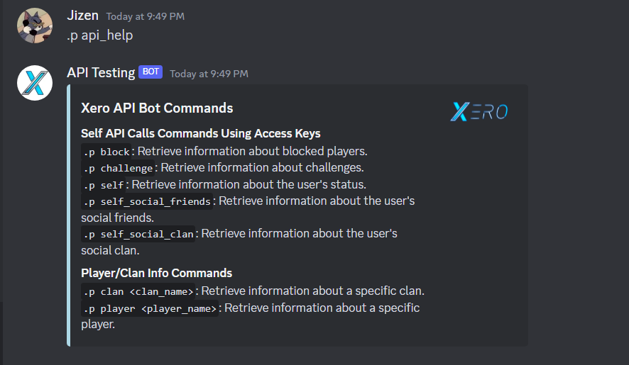

# Xero API Discord Bot


## Overview

The **Xero API Bot** is a Python-based Discord bot designed to streamline interactions with the Xero API, making it more accessible,easier, and user-friendly. This bot provides users with an intuitive way to access information about blocked players, challenges, user status, clans, and players on the xero.gg platform.

## Features

- **Self API Interaction:**
  - Retrieve detailed information about blocked players, challenges, user status, social friends, and social clan using simple Discord commands.

- **Player/Clan Info:**
  - Obtain in-depth information about specific clans and players by providing their names.

- **Help Command:**
  - Quickly access information about available bot commands with the `api_help` command.

## Installation

1. **Prerequisites:**
   - Ensure you have Python installed on your machine.
   - Install the required Python packages:

      ```bash
      pip install discord.py requests
      ```

2. **Bot Setup:**
   - Copy and paste the provided bot code into a Python file (e.g., `main.py`).

3. **Replace Bot Token and Xero API Keys:**
   - Open the `main.py`, `cogs/player_clan.py`
   - Locate the following lines:

     ```python
     # Placeholder values for the bot token and Xero API keys
     BOT_TOKEN = "YOUR_DISCORD_BOT_TOKEN"
     XERO_API_ACCESS_KEY_ID = "YOUR_XERO_API_ACCESS_KEY_ID"
     XERO_API_SECRET_ACCESS_KEY = "YOUR_XERO_API_SECRET_ACCESS_KEY"
     ```

   - Replace the placeholder values with your actual credentials:
     - `YOUR_DISCORD_BOT_TOKEN`: Replace with your Discord bot token obtained from the [Discord Developer Portal](https://discord.com/developers/applications) in main.py.
     - `YOUR_XERO_API_ACCESS_KEY_ID` and `YOUR_XERO_API_SECRET_ACCESS_KEY`: Replace with your Xero API access keys obtained from the [Xero API Dashboard](https://xero.gg/settings/api) in player_clan.py.

4. **Run the Bot:**
   - Execute the following command to run the bot:

      ```bash
      python main.py
      ```

## Usage

1. **Invite the Bot:**
   - Invite the bot to your Discord server.

2. **Bot Commands:**
   - Use the following commands to interact with the Xero API and retrieve valuable gaming information.

## Commands

### Self API Commands

#### `.p block`

Retrieve detailed information about blocked players.

#### `.p challenge`

Retrieve information about ongoing challenges.

#### `.p self`

Get an overview of the user's current status.

#### `.p self_social_friends`

Retrieve information about the user's social friends.

#### `.p self_social_clan`

Get insights into the user's social clan.

### Player/Clan Info Commands

#### `.p clan <clan_name>`

Retrieve detailed information about a specific clan.

#### `.p player <player_name>`

Get comprehensive details about a specific player.

### Help Command

#### `.p api_help`

Display a comprehensive help message containing information about all available bot commands.



## Contribution

Contributions are welcome! If you have ideas for improvements, new features, or encounter any issues, please feel free to open an issue or submit a pull request.

## License

This project is licensed under the [MIT License](LICENSE).

---

